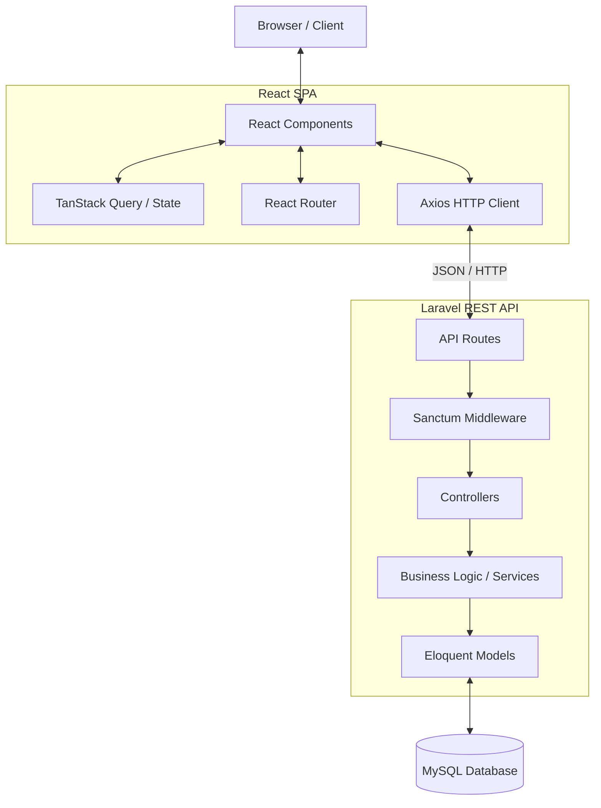

# System Architecture

## 1. Tech Stack

**Backend**:
- Laravel 13
- PHP 8.5+
- MySQL
- Laravel Sanctum
- REST API
- Eloquent ORM

**Frontend**:
- React
- Vite
- React Router
- Axios
- Tailwind CSS
- Lucide React
- TanStack Query
- Recharts

## 2. Architecture Pattern

React SPA
↓
Laravel REST API
↓
MySQL

- Laravel berfungsi sepenuhnya sebagai Backend/API (headless).
- React berfungsi sepenuhnya sebagai Frontend (Single Page Application).
- Tidak menggunakan Blade sebagai frontend aplikasi.

## 3. High Level Architecture



## 4. Folder Structure

### Backend

```text
backend/
├── app/
│   ├── Http/
│   │   ├── Controllers/
│   │   ├── Middleware/
│   │   ├── Requests/
│   │   └── Resources/
│   ├── Models/
│   ├── Policies/
│   └── Services/
├── bootstrap/
├── config/
├── database/
│   ├── factories/
│   ├── migrations/
│   └── seeders/
├── routes/
│   ├── api.php
│   └── web.php
├── storage/
└── tests/
```

### Frontend

```text
frontend/
├── src/
│   ├── components/      # Reusable UI components
│   ├── features/        # Feature-based modules (Kamar, Penghuni, dll)
│   ├── hooks/           # Custom React hooks
│   ├── layouts/         # Page layouts (DashboardLayout, AuthLayout)
│   ├── lib/             # Third-party library configs (axios, utils)
│   ├── pages/           # Route components
│   ├── routes/          # Route definitions
│   ├── services/        # API calls integration
│   └── utils/           # Helper functions
```

## 5. Data Flow

User
→ React
→ Axios
→ Laravel API
→ Controller
→ Request Validation
→ Authorization
→ Service
→ Model
→ Database
→ API Resource
→ React

## 6. Services

- **AuthService**: Menangani logika autentikasi, token creation, dan validasi credential.
- **DashboardService**: Menggabungkan data dari berbagai model untuk metrik dashboard.
- **KostService**: Mengelola informasi dasar properti kost.
- **KamarService**: Logika CRUD kamar dan penentuan status kamar.
- **PenghuniService**: Mengelola data personal penghuni.
- **KontrakService**: Logika pembuatan, perpanjangan, dan terminasi kontrak sewa.
- **TagihanService**: Pembuatan tagihan berkala, perhitungan denda, dan pengecekan status tagihan.
- **PembayaranService**: Verifikasi pembayaran dan update status tagihan terkait.
- **PengeluaranService**: Pencatatan biaya operasional.
- **LaporanService**: Generate data laporan bulanan, format ke PDF/Excel.
- **NotificationService**: Trigger notifikasi in-app untuk penghuni/admin.

## 7. Routing

**Frontend Routing (React Router)**:
- `/login` : Halaman Login
- `/dashboard` : Dashboard Utama
- `/kamar` : Manajemen Kamar
- `/penghuni` : Manajemen Penghuni
- `/tagihan` : Manajemen Tagihan
- `/pengeluaran` : Manajemen Pengeluaran
- `/laporan` : Laporan Keuangan

**Backend API Routing (Laravel)**:
- `POST /api/login` : Login
- `POST /api/logout` : Logout
- `GET /api/user` : Get Current User
- `GET/POST/PUT/DELETE /api/kamar` : CRUD Kamar
- `GET/POST/PUT/DELETE /api/penghuni` : CRUD Penghuni
- `GET/POST/PUT/DELETE /api/kontrak` : CRUD Kontrak
- `GET/POST/PUT/DELETE /api/tagihan` : CRUD Tagihan
- `POST /api/pembayaran/{tagihan}` : Proses Pembayaran
- `GET/POST/PUT/DELETE /api/pengeluaran` : CRUD Pengeluaran
- `GET /api/dashboard/stats` : Get Dashboard Metrics

## 8. Security

- **Sanctum**: Digunakan untuk otentikasi API berbasis token atau SPA cookie-based.
- **Authentication**: Wajib untuk seluruh endpoint kecuali login.
- **Authorization**: Role-based access control (Owner, Admin, Penghuni).
- **Policy**: Menerapkan Laravel Policy (contoh: `PenghuniPolicy` memastikan penghuni hanya bisa melihat tagihannya sendiri).
- **Middleware**: Memisahkan route berdasarkan role (e.g., `role:admin,owner`).
- **Validation**: Seluruh input divalidasi menggunakan Laravel Form Requests.
- **Rate Limiting**: Diterapkan pada route autentikasi untuk mencegah brute-force.
- **CORS**: Dikonfigurasi ketat hanya mengizinkan domain frontend.
- **File Upload Security**: Validasi MIME type, batasan ukuran, dan penyimpanan di direktori private yang tidak dapat dieksekusi.
- **Password Security**: Menggunakan algoritma Bcrypt bawaan Laravel.

## 9. Testing

- **Backend**: PHPUnit/Pest untuk Unit Testing (Models, Services) dan Feature Testing (API Endpoints, Authorization, Validation).
- **Frontend**: Vitest & React Testing Library untuk Unit Component Testing.
- **Integration**: End-to-end flow diuji secara keseluruhan untuk modul kritis seperti pembayaran dan pembuatan kontrak.

## 10. Deployment

- **Backend**: Di-host di VPS/Cloud Platform (AWS EC2 / DigitalOcean Droplet) menggunakan Nginx & PHP-FPM.
- **Frontend**: Di-build menjadi static files dan disajikan melalui CDN atau Vercel / Netlify.
- **Database**: Managed Database Service (AWS RDS) atau MySQL instance terdedikasi.
- **CI/CD**: GitHub Actions untuk automated testing dan deployment ke staging/production.

---
**Related Documents:**
- [[000 - Home Dashboard]], [[Agent]], [[Design]]
- [[Product Requirements Document]], [[Prompt Master - Mobile UI]], [[Schema]]
- [[Database ERD]], [[System Architecture]], [[Template - API Endpoint Spec]]
- [[Template - Architecture Decision Record]], [[Template - Feature Specification]], [[Web_Panel_Update_Summary]]
- [[API]], [[Deployment]], [[Roadmap]]
- [[Security]], [[Testing]], [[User-Flow]]
