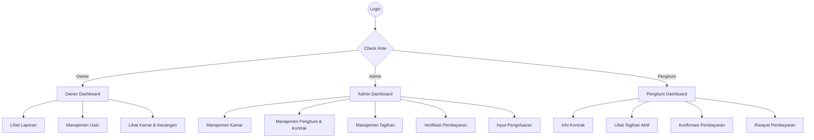

# UI/UX Design Specification

## 1. UI/UX Flow

## 2. Design System

- **Primary**: `#4F46E5` (Indigo-600) - Action buttons, active states
- **Secondary**: `#6B7280` (Gray-500) - Secondary buttons, neutral actions
- **Success**: `#10B981` (Emerald-500) - Lunas, Terisi, Success messages
- **Warning**: `#F59E0B` (Amber-500) - Pending, Belum Lunas
- **Danger**: `#EF4444` (Red-500) - Error, Delete actions, Kosong
- **Info**: `#3B82F6` (Blue-500) - Information alerts
- **Background**: `#F3F4F6` (Gray-100) - App background
- **Surface**: `#FFFFFF` (White) - Cards, Modals, Sidebar
- **Text**: `#111827` (Gray-900) untuk Heading, `#4B5563` (Gray-600) untuk Body

**Style**:
- Modern
- Professional
- Clean
- Minimal
- SaaS Dashboard

## 3. Typography

**Font Family**: Inter

- **Heading 1**: 24px, Bold (Page Titles)
- **Heading 2**: 20px, Semi-Bold (Section Titles)
- **Heading 3**: 16px, Medium (Card Titles)
- **Body**: 14px, Regular (General Text, Table Content)
- **Label**: 12px, Medium (Form Labels)
- **Caption**: 12px, Regular, Text-Gray-500 (Helper text)

## 4. Components

- **Button**: Variasi Primary, Secondary, Outline, Ghost, Danger. Ukuran sm, md, lg.
- **Input**: TextField dengan state normal, focus, error, disabled.
- **Select**: Dropdown seleksi tunggal dan ganda.
- **Textarea**: Untuk input deskripsi atau alamat.
- **Checkbox**: Standar input checkbox.
- **Modal**: Untuk form tambah/edit data, konfirmasi aksi. Memiliki overlay gelap.
- **Drawer**: Sidebar dari kanan untuk filter kompleks atau rincian detail.
- **Dropdown**: Context menu untuk action di tabel (Edit, Delete, View).
- **Table**: Data grid dengan header sticky, state empty, dan loading state.
- **Pagination**: Kontrol halaman di bawah tabel.
- **Search**: Input dengan ikon kaca pembesar untuk pencarian.
- **Filter**: Kumpulan filter berdasarkan status, tanggal.
- **Badge**: Indikator status (Lunas/Belum Lunas, Terisi/Kosong).
- **Alert**: Banner notifikasi statis di halaman.
- **Toast**: Notifikasi mengambang temporer (sukses simpan data).
- **Card**: Wadah konten modular dengan bayangan halus (shadow-sm).
- **Tabs**: Navigasi konten dalam satu halaman yang sama.
- **Breadcrumb**: Menunjukkan hirarki halaman saat ini.
- **Navbar**: Topbar berisi profil user, notifikasi, dan tombol mobile menu.
- **Sidebar**: Navigasi utama dengan ikon Lucide React.
- **Empty State**: Ilustrasi/ikon dan teks saat data kosong dengan tombol aksi utama.
- **Loading State**: Spinner indikator proses.
- **Error State**: Pesan gagal fetch data dan tombol coba lagi.
- **Skeleton**: Loading placeholder (skeleton UI) saat fetch data tabel/card.

## 5. Dashboard

**Owner Dashboard**:
- Total Kamar
- Kamar Terisi
- Kamar Kosong
- Total Penghuni
- Pendapatan
- Pengeluaran
- Keuntungan
- Tagihan Belum Lunas
- Kontrak Akan Berakhir
- Grafik Pendapatan

## 6. Responsive Design

- **Desktop (>= 1024px)**: Sidebar tetap di kiri (expanded), area konten utama di kanan. Tabel menampilkan semua kolom.
- **Tablet (768px - 1023px)**: Sidebar bisa di-collapse menjadi ikon saja. Tabel mulai disembunyikan kolom kurang pentingnya atau discroll horizontal.
- **Mobile (< 768px)**: Sidebar tersembunyi (diakses via hamburger menu di Navbar). Tabel diubah bentuknya menjadi tumpukan Card. Grafik disederhanakan.

## 7. Design Decisions

- **Tailwind CSS**: Dipilih untuk mempercepat styling konsisten dan customizability.
- **SaaS Dashboard Layout**: Mengikuti standar industri agar user familiar tanpa perlu training panjang.
- **Lucide React**: Ikon yang bersih dan konsisten sesuai style minimalis.
- **Skeleton UI vs Spinner**: Menggunakan Skeleton untuk layout halaman agar tidak 'loncat' saat data selesai dimuat, meningkatkan persepsi kecepatan performa.

---
**Related Documents:**
- [[000 - Home Dashboard]], [[Agent]], [[Architecture]]
- [[Product Requirements Document]], [[Prompt Master - Mobile UI]], [[Schema]]
- [[Database ERD]], [[System Architecture]], [[Template - API Endpoint Spec]]
- [[Template - Architecture Decision Record]], [[Template - Feature Specification]], [[Web_Panel_Update_Summary]]
- [[API]], [[Deployment]], [[Roadmap]]
- [[Security]], [[Testing]], [[User-Flow]]
