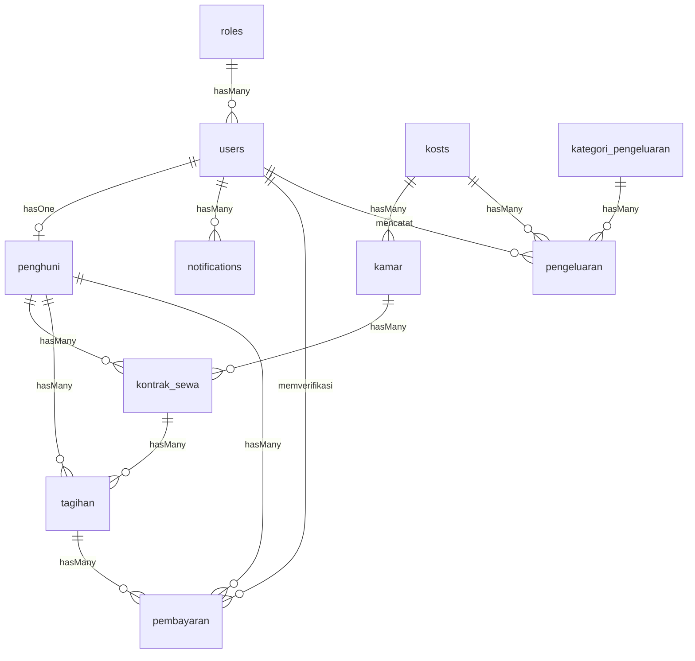

# Database Schema

## 1. Tables

### users
| Column | Type | Nullable | Default | Key | Description |
|---|---|---|---|---|---|
| id | bigint | No | - | PK | Primary Key |
| name | varchar(255) | No | - | - | User's full name |
| email | varchar(255) | No | - | Unique | User's email address |
| password | varchar(255) | No | - | - | Hashed password |
| role_id | bigint | No | - | FK | References roles.id |
| created_at | timestamp | Yes | null | - | Creation timestamp |
| updated_at | timestamp | Yes | null | - | Update timestamp |
| deleted_at | timestamp | Yes | null | - | Soft delete timestamp |

### roles
| Column | Type | Nullable | Default | Key | Description |
|---|---|---|---|---|---|
| id | bigint | No | - | PK | Primary Key |
| name | varchar(50) | No | - | Unique | Role name (owner, admin, penghuni) |
| created_at | timestamp | Yes | null | - | Creation timestamp |
| updated_at | timestamp | Yes | null | - | Update timestamp |

### kosts
| Column | Type | Nullable | Default | Key | Description |
|---|---|---|---|---|---|
| id | bigint | No | - | PK | Primary Key |
| nama | varchar(255) | No | - | - | Nama kost |
| alamat | text | No | - | - | Alamat lengkap kost |
| fasilitas_umum | text | Yes | null | - | Fasilitas bersama (JSON/Text) |
| created_at | timestamp | Yes | null | - | Creation timestamp |
| updated_at | timestamp | Yes | null | - | Update timestamp |
| deleted_at | timestamp | Yes | null | - | Soft delete timestamp |

### kamar
| Column | Type | Nullable | Default | Key | Description |
|---|---|---|---|---|---|
| id | bigint | No | - | PK | Primary Key |
| kost_id | bigint | No | - | FK | References kosts.id |
| nomor_kamar | varchar(50) | No | - | - | Nomor identifikasi kamar |
| tipe | varchar(100) | No | - | - | Tipe kamar (Standard, VIP) |
| harga | decimal(15,2)| No | - | - | Harga sewa per bulan |
| fasilitas | text | Yes | null | - | Fasilitas di dalam kamar |
| status | enum | No | 'Kosong'| - | Status: Kosong, Terisi, Perbaikan |
| created_at | timestamp | Yes | null | - | Creation timestamp |
| updated_at | timestamp | Yes | null | - | Update timestamp |
| deleted_at | timestamp | Yes | null | - | Soft delete timestamp |

### penghuni
| Column | Type | Nullable | Default | Key | Description |
|---|---|---|---|---|---|
| id | bigint | No | - | PK | Primary Key |
| user_id | bigint | No | - | FK | References users.id |
| nik | varchar(20) | No | - | Unique | Nomor Induk Kependudukan |
| telepon | varchar(20) | No | - | - | Nomor handphone/WhatsApp |
| kontak_darurat | varchar(20) | No | - | - | Nomor telepon darurat |
| foto_ktp | varchar(255) | Yes | null | - | Path file foto KTP |
| created_at | timestamp | Yes | null | - | Creation timestamp |
| updated_at | timestamp | Yes | null | - | Update timestamp |
| deleted_at | timestamp | Yes | null | - | Soft delete timestamp |

### kontrak_sewa
| Column | Type | Nullable | Default | Key | Description |
|---|---|---|---|---|---|
| id | bigint | No | - | PK | Primary Key |
| kamar_id | bigint | No | - | FK | References kamar.id |
| penghuni_id | bigint | No | - | FK | References penghuni.id |
| tanggal_mulai | date | No | - | - | Tanggal awal kontrak |
| tanggal_selesai| date | No | - | - | Tanggal akhir kontrak |
| harga_kesepakatan| decimal(15,2)| No | - | - | Harga final sewa bulanan |
| status | enum | No | 'Aktif' | - | Status: Aktif, Selesai, Batal |
| created_at | timestamp | Yes | null | - | Creation timestamp |
| updated_at | timestamp | Yes | null | - | Update timestamp |
| deleted_at | timestamp | Yes | null | - | Soft delete timestamp |

### tagihan
| Column | Type | Nullable | Default | Key | Description |
|---|---|---|---|---|---|
| id | bigint | No | - | PK | Primary Key |
| penghuni_id | bigint | No | - | FK | References penghuni.id |
| kontrak_sewa_id| bigint | No | - | FK | References kontrak_sewa.id |
| bulan_tagihan | date | No | - | - | Bulan referensi tagihan (YYYY-MM-01)|
| nominal | decimal(15,2)| No | - | - | Jumlah tagihan utama |
| denda | decimal(15,2)| No | 0 | - | Tambahan denda keterlambatan |
| total_tagihan | decimal(15,2)| No | - | - | nominal + denda |
| jatuh_tempo | date | No | - | - | Batas akhir pembayaran |
| status | enum | No | 'Belum Lunas'| - | Status: Belum Lunas, Lunas, Cicilan|
| created_at | timestamp | Yes | null | - | Creation timestamp |
| updated_at | timestamp | Yes | null | - | Update timestamp |
| deleted_at | timestamp | Yes | null | - | Soft delete timestamp |

### pembayaran
| Column | Type | Nullable | Default | Key | Description |
|---|---|---|---|---|---|
| id | bigint | No | - | PK | Primary Key |
| tagihan_id | bigint | No | - | FK | References tagihan.id |
| penghuni_id | bigint | No | - | FK | References penghuni.id |
| tanggal_bayar | date | No | - | - | Tanggal pembayaran dilakukan |
| nominal_bayar | decimal(15,2)| No | - | - | Jumlah yang dibayarkan |
| metode_pembayaran| varchar(50) | No | - | - | Transfer Bank, Cash, dll. |
| bukti_pembayaran| varchar(255) | Yes | null | - | Path file bukti transfer |
| status_verifikasi| enum | No | 'Pending'| - | Pending, Valid, Invalid |
| diverifikasi_oleh| bigint | Yes | null | FK | References users.id (Admin/Owner) |
| created_at | timestamp | Yes | null | - | Creation timestamp |
| updated_at | timestamp | Yes | null | - | Update timestamp |
| deleted_at | timestamp | Yes | null | - | Soft delete timestamp |

### kategori_pengeluaran
| Column | Type | Nullable | Default | Key | Description |
|---|---|---|---|---|---|
| id | bigint | No | - | PK | Primary Key |
| nama_kategori | varchar(100) | No | - | Unique | Listrik, Air, Perbaikan, dll. |
| created_at | timestamp | Yes | null | - | Creation timestamp |
| updated_at | timestamp | Yes | null | - | Update timestamp |

### pengeluaran
| Column | Type | Nullable | Default | Key | Description |
|---|---|---|---|---|---|
| id | bigint | No | - | PK | Primary Key |
| kost_id | bigint | No | - | FK | References kosts.id |
| kategori_id | bigint | No | - | FK | References kategori_pengeluaran.id |
| tanggal | date | No | - | - | Tanggal pengeluaran |
| nominal | decimal(15,2)| No | - | - | Jumlah pengeluaran |
| keterangan | text | Yes | null | - | Rincian pengeluaran |
| bukti_struk | varchar(255) | Yes | null | - | Path file bukti struk |
| dicatat_oleh | bigint | No | - | FK | References users.id |
| created_at | timestamp | Yes | null | - | Creation timestamp |
| updated_at | timestamp | Yes | null | - | Update timestamp |
| deleted_at | timestamp | Yes | null | - | Soft delete timestamp |

### notifications
| Column | Type | Nullable | Default | Key | Description |
|---|---|---|---|---|---|
| id | bigint | No | - | PK | Primary Key |
| user_id | bigint | No | - | FK | References users.id |
| title | varchar(255) | No | - | - | Judul notifikasi |
| message | text | No | - | - | Isi pesan notifikasi |
| is_read | boolean | No | false | - | Status sudah dibaca atau belum |
| created_at | timestamp | Yes | null | - | Creation timestamp |
| updated_at | timestamp | Yes | null | - | Update timestamp |

## 2. Relationships

- **Kost**
  - `hasMany` Kamar
  - `hasMany` Pengeluaran
- **Kamar**
  - `belongsTo` Kost
  - `hasMany` KontrakSewa
- **Penghuni**
  - `belongsTo` User
  - `hasMany` KontrakSewa
  - `hasMany` Tagihan
  - `hasMany` Pembayaran
- **KontrakSewa**
  - `belongsTo` Kamar
  - `belongsTo` Penghuni
  - `hasMany` Tagihan
- **Tagihan**
  - `belongsTo` Penghuni
  - `belongsTo` KontrakSewa
  - `hasMany` Pembayaran
- **Pembayaran**
  - `belongsTo` Tagihan
  - `belongsTo` Penghuni
  - `belongsTo` User (diverifikasi_oleh)
- **KategoriPengeluaran**
  - `hasMany` Pengeluaran
- **Pengeluaran**
  - `belongsTo` Kost
  - `belongsTo` KategoriPengeluaran
  - `belongsTo` User (dicatat_oleh)
- **Users**
  - `belongsTo` Role
  - `hasOne` Penghuni
  - `hasMany` Notifications

## 3. ERD

## 4. Database Decisions

- **Naming Convention**: Tabel menggunakan snake_case dan plural.
- **Primary Key**: Menggunakan `bigint` auto-increment (`id`) untuk semua tabel.
- **Foreign Key**: Didefinisikan secara eksplisit untuk menjaga integritas data.
- **Index**: Dibuat pada kolom-kolom pencarian sering seperti `nomor_kamar`, `nik`, `status`.
- **Soft Delete**: Diterapkan pada data transaksional dan master menggunakan `deleted_at` agar data history tidak hilang.
- **Timestamp**: Menggunakan `created_at` dan `updated_at` bawaan Laravel.
- **Status**: Menggunakan tipe `enum` untuk nilai status yang pasti.
- **Decimal/Money**: Menggunakan tipe `decimal(15,2)` untuk kolom yang menyimpan nilai uang untuk menghindari masalah presisi floating point.
- **File Storage**: Hanya menyimpan path file (string `varchar(255)`) di database, file asli disimpan di local storage atau S3.

---
**Related Documents:**
- [[000 - Home Dashboard]], [[Agent]], [[Architecture]]
- [[Design]], [[Product Requirements Document]], [[Prompt Master - Mobile UI]]
- [[Database ERD]], [[System Architecture]], [[Template - API Endpoint Spec]]
- [[Template - Architecture Decision Record]], [[Template - Feature Specification]], [[Web_Panel_Update_Summary]]
- [[API]], [[Deployment]], [[Roadmap]]
- [[Security]], [[Testing]], [[User-Flow]]
