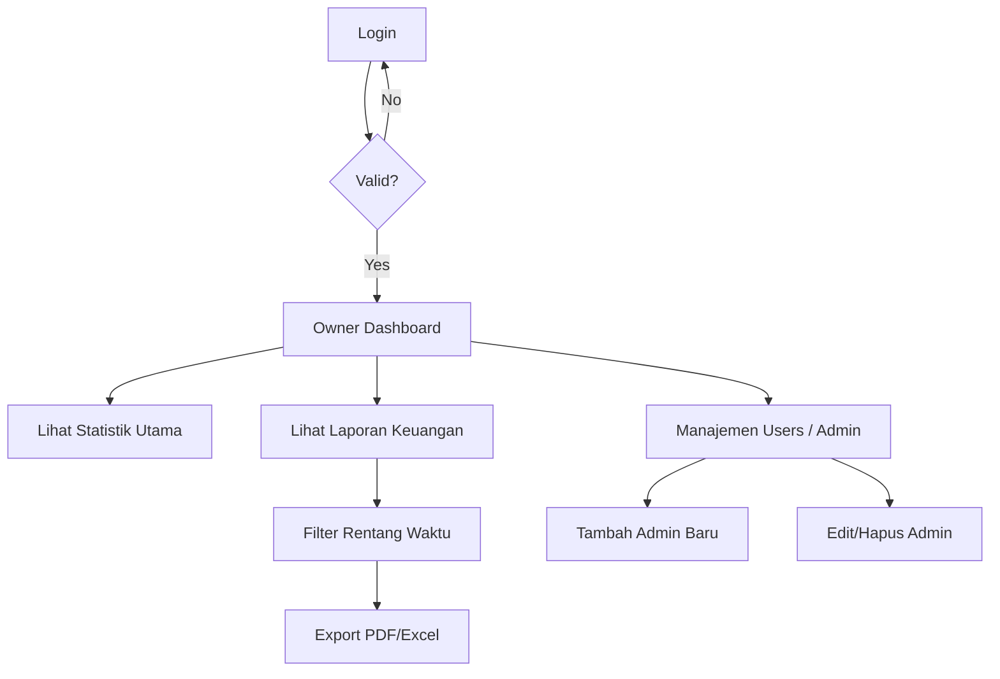
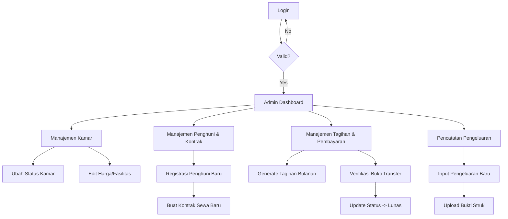
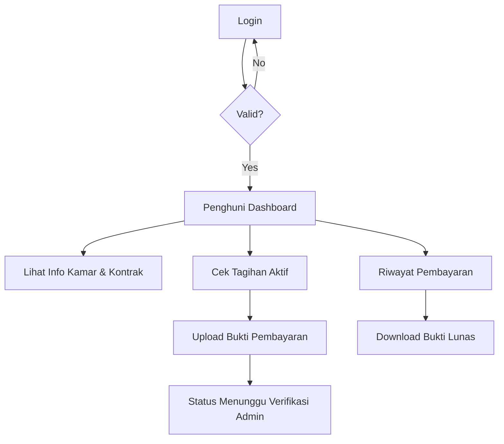

# User Flows

## 1. Owner Flow

## 2. Admin Flow

## 3. Penghuni Flow

---
**Related Documents:**
- [[000 - Home Dashboard]], [[Agent]], [[Architecture]]
- [[Design]], [[Product Requirements Document]], [[Prompt Master - Mobile UI]]
- [[Schema]], [[Database ERD]], [[System Architecture]]
- [[Template - API Endpoint Spec]], [[Template - Architecture Decision Record]], [[Template - Feature Specification]]
- [[Web_Panel_Update_Summary]], [[API]], [[Deployment]]
- [[Roadmap]], [[Security]], [[Testing]]
